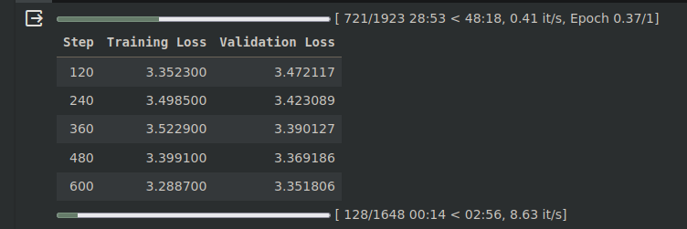
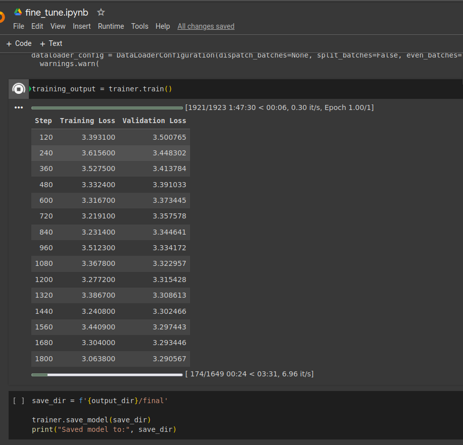

# fine-tune LLM

## requirements
- for implementation: higher level abstraction of transformers(huggingface) has been used; can be done with torch for better control over things
```
pip install transformers[torch] datasets
pip install huggingface_hub
```

## references
- [Alpaca: A Strong, Replicable Instruction-Following Model](https://crfm.stanford.edu/2023/03/13/alpaca.html)
- [meta-review dataset](https://huggingface.co/datasets/zqz979/meta-review)
- [base model](https://huggingface.co/EleutherAI/pythia-70m)
- [pythia paper](https://arxiv.org/pdf/2304.01373.pdf)

## task
- to finetune an open source LLM on [meta-review dataset](https://huggingface.co/datasets/zqz979/meta-review) to automatically summarize meta review data of academia papers. 
- its really interesting project, since there are so many papers coming out in ai these days. websites like [openreview](https://openreview.net/) have got the peer-review of many decent papers, can directly apply finetuned model on such websites.

## restrictoins
- **compute:** yeah it is the case most of the time with experiments on individual level. colab compute is not enough and its slow, even for a 70M parameter model. takes 1.5 hrs for 1 epoch of meta-review with pythia-70m variant.
- **context length:** pythia models have max sequence length `2048`. reference: on page 4 of [pythia paper](https://arxiv.org/pdf/2304.01373.pdf)
    - "Consequently, we use a batch size of 1024 samples with a
sequence length of 2048 (2,097,152 tokens) for all models,
in order to maintain consistency across all Pythia model
training runs."

## pre-processing
- removed all chars except `a-zA-Z0-9\s`, to help model only focus on the essense of reviews, and not get distracted by side-things in scraped content. i believe in the power of llms to extract patterns from real raw data[given they have got quality for the task], and not too much spoon feeding by pre-processing everything.

## hyperparamters
- learning rate: experimented on smaller scale with 1e-3 and 1e-4; not giving smooth learning. tested 1e-5 , gives better learning than former ones. So lr=1e-5. Here learning is in the loss sense.
- no of epochs: 15-20 should suffice, however due to compute restrictions only 1 has been done.

## prompt enginnering
- tried 2-3 different prompts. however due to model only being finetuned for only 1 epoch, prompts give more or less similar bad outputs :).
- for post processing added extra instruction in prompt to limit model to generate to some words.

## evaluation
- standard evaluation on benchmarking datasets(eg. MMLU, HellaSwag etc) does not make sense because we are finetuning on very sepcific use case. infact hypothesis is that finetuned would perform worse than basemodel on these benchmarks
- rather created an evaluation pipeline to inference on the models to generate output for some test cases for manual eval
    - eval_examples.xlsx file contains some test cases, both are doing almost similary bad(expected as model has been evaluated for 1 epoch), they start repeating after some tokens

## future todos
- finetune on at least 1B model variant of pythia or even better llama-7B
- if got compute: change no of epochs(in fine_tune.py) and model variant; then just execute `python fine_tune.py` with requirements all setup.
- to evaluate decently finetuned model create standard NLP metrices evaluation pipeline

## where is what
- files: all scripts are commented adequately
    - [processing_meta_review.py](./processing_meta_review.py): preprocessing of meta-review and uploading it to hub back
    - [fine_tune.py](./fine_tune.py): incapsulated fine-tune script
    - [evaluation.py](./evaluation.py): for inference and evaluation
    - [eval_examples.xlsx](./eval_examples.xlsx): some test case examples
- dir tree
```
.
├── assets
│   ├── test1.png
│   └── test2.png
├── eval_examples.xlsx
├── evaluation.py
├── fine_tune.py
├── processing_meta_review.py
└── README.md
```
- on hub
    - [processed meta-review](https://huggingface.co/datasets/sdansdk/processed_meta_review)
    - [processed meta-review](https://huggingface.co/datasets/sdansdk/tokenized_meta_review)
    - [pythia finetuned-0/1-epoch](https://huggingface.co/sdansdk/pythia_70m_finetuned_1)
    - [pythia finetuned-1/1-epoch](https://huggingface.co/sdansdk/pythia_70m_finetuned)
    - [pythia tokenizer](https://huggingface.co/sdansdk/pythia_70m_tokenizer): forked from pythia_70m directly

## some screenshots
- training runs
    - smaller one: 
        - 
    - larger one(and even that is 1 epoch :(
        - 
